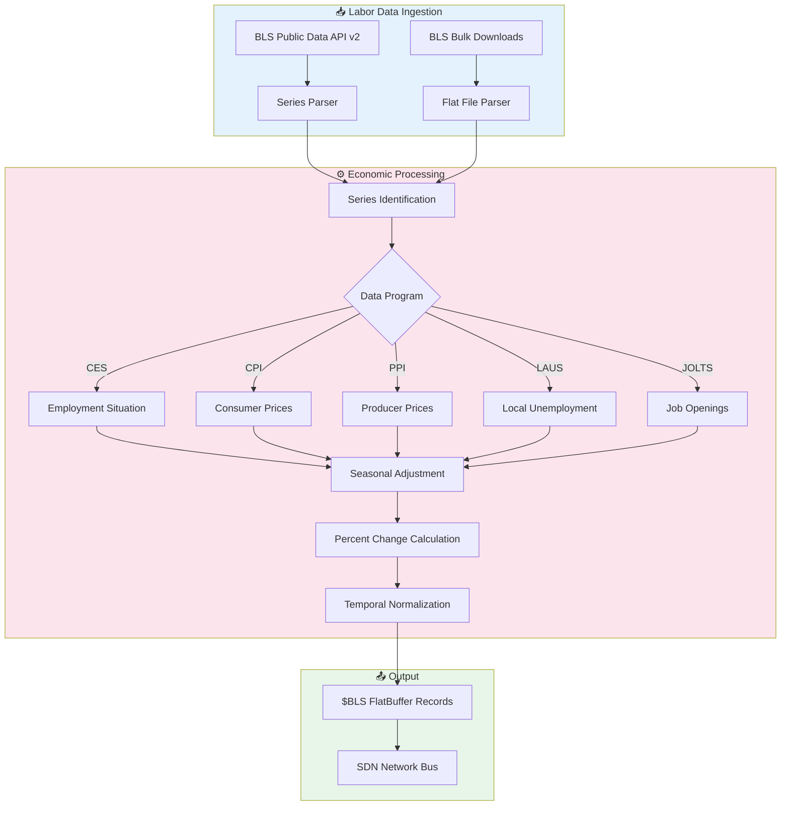
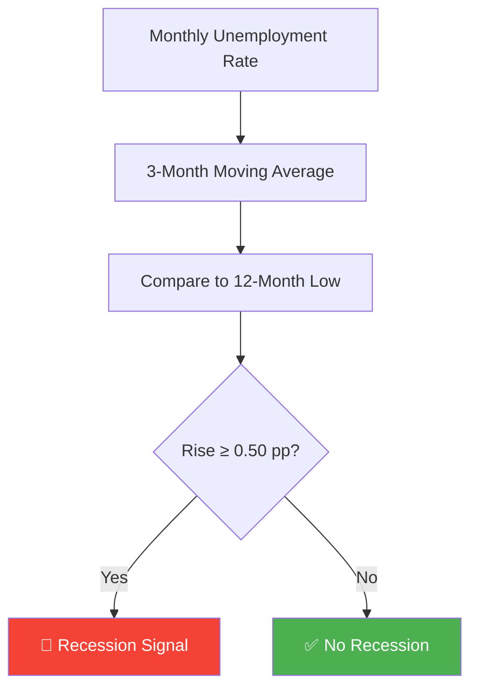

<](https://github.com/the-lobsternaut/bls-sdn-plugin/actions)
[](LICENSE)
[](https://github.com/the-lobsternaut/space-data-network)
[](#output-format)

**Bureau of Labor Statistics** — CPI, unemployment, nonfarm payrolls, Producer Price Index, and labor market data from the US Department of Labor, compiled to WebAssembly for edge deployment.

---

## Overview

The Bureau of Labor Statistics (BLS) is the principal federal agency responsible for measuring labor market activity, working conditions, price changes, and productivity in the US economy. This plugin ingests key BLS economic indicators — particularly those affecting the aerospace and defense labor market — and converts them to FlatBuffers-aligned binary format.

### Why It Matters

- **Aerospace labor market**: Track employment in NAICS 3364 (Aerospace Product & Parts Manufacturing)
- **Wage inflation**: Monitor Average Hourly Earnings to assess space industry labor costs
- **CPI detail**: Granular price indices beyond the headline number (transportation, energy, services)
- **PPI for defense inputs**: Producer Price Indices for metals, electronics, and aerospace components
- **Recession signals**: Nonfarm payrolls and unemployment rate are the gold standard for recession dating

---

## Architecture


### Data Flow



---

## Data Sources & APIs

| Source | URL | Description |
|--------|-----|-------------|
| **BLS Public Data API** | https://api.bls.gov/publicAPI/v2/ | RESTful API (up to 50 series/query) |
| **BLS Data Finder** | https://data.bls.gov/cgi-bin/dbdown | Bulk data downloads |
| **BLS API Docs** | https://www.bls.gov/developers/ | Developer documentation |
| **CPI Data** | https://www.bls.gov/cpi/ | Consumer Price Index |
| **Employment Situation** | https://www.bls.gov/ces/ | Current Employment Statistics |

---

## Key Series Tracked

| Series ID | Name | Program | Frequency |
|-----------|------|---------|-----------|
| `CES0000000001` | Total Nonfarm Payrolls | CES | Monthly |
| `LNS14000000` | Unemployment Rate | LAUS | Monthly |
| `CES3236400001` | Aerospace Manufacturing Employment | CES | Monthly |
| `CUSR0000SA0` | CPI-U All Items (SA) | CPI | Monthly |
| `CUSR0000SA0L1E` | Core CPI (Less Food & Energy) | CPI | Monthly |
| `CUSR0000SETB01` | CPI Gasoline | CPI | Monthly |
| `WPUFD4` | PPI Final Demand | PPI | Monthly |
| `PCU336413336413` | PPI Guided Missiles & Space Vehicles | PPI | Monthly |
| `CES0500000003` | Average Hourly Earnings (Private) | CES | Monthly |
| `JTS000000000000000JOL` | Total Job Openings | JOLTS | Monthly |

---

## Research & References

- BLS (2024). ["BLS Handbook of Methods"](https://www.bls.gov/opub/hom/). Bureau of Labor Statistics.
- BLS (2024). ["CPI Technical Note"](https://www.bls.gov/cpi/technical-notes/). Consumer Price Index methodology.
- Sahm, C. (2019). ["Direct Stimulus Payments to Individuals"](https://www.hamiltonproject.org/assets/files/Sahm_web_20190506.pdf). Hamilton Project — the Sahm Rule recession indicator.
- NBER Business Cycle Dating: https://www.nber.org/research/data/us-business-cycle-expansions-and-contractions

---

## Technical Details

### BLS Data Programs

| Program | Code | Description |
|---------|------|-------------|
| **CES** | Current Employment Statistics | Nonfarm payrolls, hours, earnings |
| **CPI** | Consumer Price Index | Urban consumer price inflation |
| **PPI** | Producer Price Index | Wholesale/producer price inflation |
| **LAUS** | Local Area Unemployment | State/metro unemployment rates |
| **JOLTS** | Job Openings & Labor Turnover | Hiring, quits, openings |
| **QCEW** | Quarterly Census of Employment & Wages | Employer-level data |

### Sahm Rule Recession Indicator



### Processing Pipeline

1. **JSON Ingestion** — Parse BLS API v2 series/observations responses
2. **Series Routing** — Direct to appropriate data program handler
3. **Seasonal Adjustment** — Use SA series when available
4. **Unit Conversion** — Normalize index levels, rates, absolute numbers
5. **Percent Change** — Calculate MoM and YoY changes
6. **FlatBuffers Serialization** — Pack into `$BLS` aligned binary records

---

## Input/Output Format

### Input

JSON from the BLS API:

```json
{
  "Results": {
    "series": [
      {
        "seriesID": "CES0000000001",
        "data": [
          {
            "year": "2024",
            "period": "M01",
            "periodName": "January",
            "value": "157533",
            "footnotes": [{}]
          }
        ]
      }
    ]
  }
}
```

### Output

`$BLS` FlatBuffer-aligned binary records:

| Field | Type | Description |
|-------|------|-------------|
| `timestamp` | `float64` | Unix epoch seconds of observation period |
| `latitude` | `float64` | 0.0 (national data) or state centroid |
| `longitude` | `float64` | 0.0 (national data) or state centroid |
| `value` | `float64` | Observation value |
| `source_id` | `string` | BLS series ID |
| `category` | `string` | Data program (CES/CPI/PPI/LAUS) |
| `description` | `string` | Series title and period |

**File Identifier:** `$BLS`

---

## Build Instructions

### Quick Build

```bash
cd plugins/bls
./build.sh
```

### Manual Build

```bash
cd plugins/bls
git submodule update --init deps/emsdk
cd deps/emsdk && ./emsdk install latest && ./emsdk activate latest && cd ../..
source deps/emsdk/emsdk_env.sh
cd src/cpp && emcmake cmake -B build -S . && emmake make -C build
```

### Run Tests

```bash
cd src/cpp
cmake -B build -S . && cmake --build build && ctest --test-dir build
```

---

## Usage Examples

### Node.js

```javascript
import { SDNPlugin } from '@the-lobsternaut/sdn-plugin-sdk';

const plugin = await SDNPlugin.load('./wasm/node/bls.wasm');

const data = await fetch('https://api.bls.gov/publicAPI/v2/timeseries/data/', {
  method: 'POST',
  headers: { 'Content-Type': 'application/json' },
  body: JSON.stringify({
    seriesid: ['CES0000000001', 'LNS14000000'],
    startyear: '2023',
    endyear: '2024'
  })
});
const result = plugin.parse(await data.text());
console.log(`Parsed ${result.records} BLS observations`);
```

### C++ (Direct)

```cpp
#include "bls/types.h"

auto dataset = bls::parse_json(json_input);
for (const auto& obs : dataset.records) {
    printf("👷 %s [%s]: %.1f — %s\n",
           obs.source_id.c_str(), obs.category.c_str(), obs.value, obs.description.c_str());
}
```

---

## Dependencies

| Dependency | Version | Purpose |
|-----------|---------|---------|
| **Emscripten (emsdk)** | latest | C++ → WASM compilation |
| **CMake** | ≥ 3.14 | Build system |
| **FlatBuffers** | ≥ 23.5 | Binary serialization |
| **C++17** | — | Language standard |

---

## Plugin Manifest

```json
{
  "schemaVersion": 1,
  "name": "bls",
  "version": "0.1.0",
  "description": "Bureau of Labor Statistics. Parses CPI, unemployment, nonfarm payrolls, PPI",
  "author": "DigitalArsenal",
  "license": "Apache-2.0",
  "inputFormats": ["application/json"],
  "outputFormats": ["$BLS"],
  "dataSources": [
    {
      "name": "bls",
      "url": "https://api.bls.gov/",
      "type": "REST",
      "auth": "api_key (optional)"
    }
  ]
}
```

---

## Project Structure

```
plugins/bls/
├── README.md
├── build.sh
├── plugin-manifest.json
├── deps/
│   └── emsdk/
├── src/cpp/
│   ├── CMakeLists.txt
│   ├── include/bls/
│   │   └── types.h
│   ├── src/
│   │   └── bls.cpp
│   ├── tests/
│   │   └── test_bls.cpp
│   └── wasm_api.cpp
└── wasm/
    └── node/
```

---

## License

This project is licensed under the [Apache License 2.0](https://www.apache.org/licenses/LICENSE-2.0).

---

## Related Plugins

- [`fred`](../fred/) — Federal Reserve Economic Data
- [`treasury`](../treasury/) — US Treasury fiscal data
- [`eia`](../eia/) — US Energy Information Administration

---

*Part of the [Space Data Network](https://github.com/the-lobsternaut/space-data-network) plugin ecosystem.*
]]>